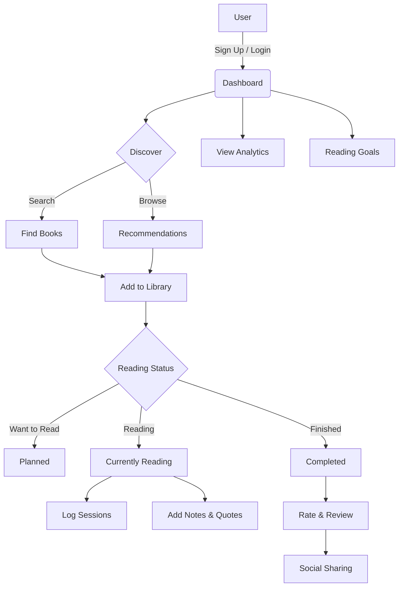

# 📚 Pagely

> **Track Your Reading Journey**

Pagely is a modern, beautifully designed book tracking application that helps you discover, manage, and reflect on your reading life. Whether you're setting yearly goals, keeping track of your library, or analyzing your reading habits, Pagely provides a seamless experience to enhance your literary journey.

🔗 **Live Demo:** [pagely-one.vercel.app](https://pagely-one.vercel.app/))

---

## ✨ Features



### Core Capabilities
* **Digital Library**: Smart shelves for all your books
* **Analytics**: Deep insights into your reading habits
* **Social**: Connect and share with fellow readers

## 🛠️ Tech Stack

Built with a modern stack for performance and developer experience:

- **Framework**: [Next.js 14](https://nextjs.org/) (App Directory)
- **Language**: TypeScript
- **Database & Auth**: [Supabase](https://supabase.com/)
- **Styling**: Tailwind CSS + [Radix UI](https://www.radix-ui.com/)
- **Animations**: Framer Motion
- **State Management**: Zustand + React Query
- **Deployment**: Vercel

## 🚀 Getting Started

To run Pagely locally, follow these steps:

1.  **Clone the repository:**
    ```bash
    git clone https://github.com/Shivangisharma4/Pagely.git
    cd Pagely
    ```

2.  **Install dependencies:**
    ```bash
    npm install
    ```

3.  **Set up environment variables:**
    Create a `.env.local` file in the root directory and add your Supabase credentials:
    ```env
    NEXT_PUBLIC_SUPABASE_URL=your_supabase_url
    NEXT_PUBLIC_SUPABASE_ANON_KEY=your_supabase_anon_key
    ```

4.  **Run the development server:**
    ```bash
    npm run dev
    ```

5.  Open [http://localhost:3000](http://localhost:3000) with your browser to see the result.

## 🤝 Contributing

Contributions are welcome! Feel free to open issues or submit pull requests to help improve Pagely.

1. Fork the Project
2. Create your Feature Branch (`git checkout -b feature/AmazingFeature`)
3. Commit your Changes (`git commit -m 'Add some AmazingFeature'`)
4. Push to the Branch (`git push origin feature/AmazingFeature`)
5. Open a Pull Request

## 📄 License

Distributed under the MIT License. See `LICENSE` for more information.

---

Built with ❤️ by [Shivangi](https://github.com/Shivangisharma4)
